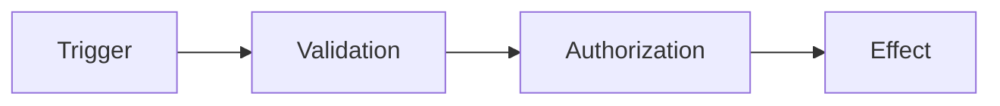

# NAVIXA Visual Review

NAVIXA-owned visual review protocol for material engineering changes.

## Purpose
Turn complex code changes into the smallest useful visual explanation so a reviewer can understand what changed, where it changed, how data or control flow changed, what could break, and how the change was verified.

This protocol is an internal engineering aid. It must not add third-party branding, attribution, runtime dependencies, UI badges, or user-facing credits.

## When to use
Use Visual Review for material changes involving one or more of:
- architecture or project boundaries
- authentication, authorization, subscriptions, billing, or account access
- APIs, database/data flow, webhooks, or integrations
- navigation or major UI flows
- shared components or behavior used by multiple NAVIXA surfaces
- migrations, deployment configuration, or risky refactors
- changes where a diagram or before/after comparison is clearer than prose

Skip it for tiny edits where a visual adds no useful information.

## Required review sequence
For a material change, produce the following in this order:

1. **Before**
   - Show only the relevant current structure or flow.
   - Do not redraw unrelated parts of the system.

2. **Change**
   - State the intended change in one concise sentence.
   - Distinguish added, modified, removed, and unchanged boundaries when useful.

3. **After**
   - Show the resulting structure or flow.
   - Make ownership and trust boundaries explicit for security-sensitive work.

4. **Affected files**
   - List files actually changed.
   - Separate directly changed files from indirectly affected areas when known.
   - Never invent filenames.

5. **Data / control path**
   - Show the path from user action or trigger to the final system effect.
   - For privileged operations, show where server-side authorization is enforced.

6. **Risk map**
   - Identify realistic regression, security, privacy, performance, and deployment risks.
   - Mark each as mitigated, verified, accepted, or unresolved.

7. **Verification**
   - Record the exact checks that actually ran and their result.
   - A build alone is not proof of correct behavior.

8. **Rollback**
   - Identify the safe restore point or reversal method for risky changes.

## Visual selection rule
Choose the smallest representation that makes the change obvious:
- compact ASCII tree for file/component ownership
- Mermaid flowchart for control/data flow
- Mermaid sequence diagram for multi-service interactions
- small before/after table for state or policy changes
- concise unified diff excerpt when the code change itself is the clearest explanation

Do not create decorative diagrams. A visual must answer a review question.

## Security-sensitive reviews
For authentication, authorization, subscriptions, billing, admin actions, or user data, the visual must show where trust changes and where enforcement happens.

Minimum questions:
- Who initiates the action?
- What identity/session is trusted?
- Where is authorization checked?
- What server-side resource is accessed or changed?
- Can another account or project cross the boundary?
- What happens on denial or failure?

Never present hidden UI, disabled buttons, route names, or client state as an authorization boundary.

## Multi-project NAVIXA rule
NAVIXA projects remain independently maintainable. A visual may show relationships between NAVIXA, Kids, English Learning, Fitness, Meetings, or future projects, but it must not imply shared runtime code, shared permissions, or shared deployment unless repository evidence confirms it.

For centralized account/subscription flows, clearly distinguish:
- central identity/access decision
- project-specific application behavior
- permitted project scope
- denied cross-project scope

## RTL / LTR
Arabic flow descriptions use right-to-left meaning and left arrows:

`المستخدم ← NAVIXA ← التحقق ← الخدمة`

English flow descriptions use left-to-right meaning and right arrows:

`User → NAVIXA → Verification → Service`

For Mermaid, prioritize semantic correctness and readable labels; do not fake directionality with misleading graph structure.

## Example template

### Before
```text
Current relevant structure only
```

### Change
One sentence describing the intended change.

### After
```text
Resulting relevant structure only
```

### Affected files
- `path/to/file`: why it changed

### Data / control path


### Risks
| Risk | Status | Evidence / mitigation |
| --- | --- | --- |
| Regression | verified / unresolved | test or explanation |
| Security | verified / unresolved | boundary/check |
| Performance | verified / unresolved | measurement/check |
| Deployment | verified / unresolved | preview/rollback |

### Verification
- `actual command/check` → result

### Rollback
- Known stable commit, branch, deployment, or reversal procedure.

## Completion rule
Visual Review is evidence, not decoration. Never claim a file changed, a test passed, a deployment succeeded, or a risk was mitigated unless repository or runtime evidence supports the claim.
